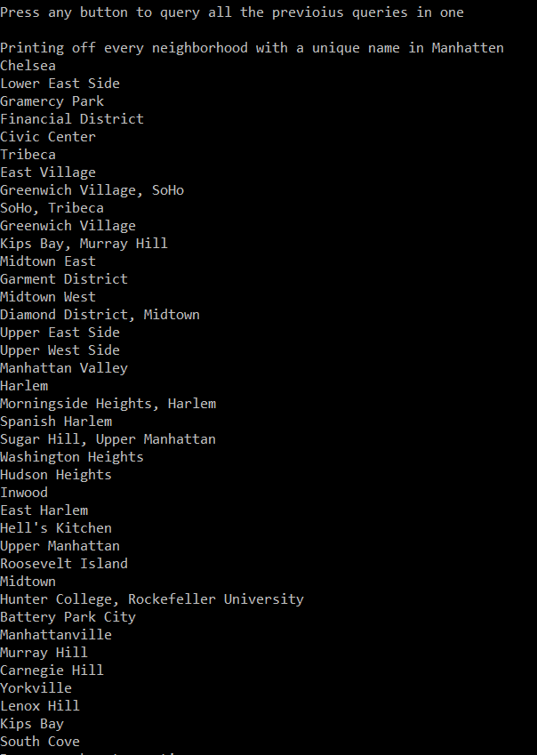

# Lab08LINQinManhatten

ARCHIVING DUE TO SECURITY WARNINGS
  - I am archiving this since this was a project for a course I was taking. It has since served its' purpose and I don't see a reason to keep updating the project.

## Summary  
This project takes json data from a separate file and then converts it to data which can be handled by C#.  
The data contains a list of neighborhoods in New York.  
It also displays how LINQ and Lambda expressions work with C#.  
It shows the ability of LINQ and Lambda expressions to chain queries one after another.  

## Visuals  
Here is a visual of the final query which chains 2 queries together:  
It makes sure that the neighborhood has a name and makes sure that the name is unique.  
  

## Instructions on How to Use  
1. Download Visual Studio  
2. Clone this GitHub repository; Lab08LINQinManhatten  
3. Open the sln file called: "Lab08LINQinManhatten.sln" in Visual Studio  
4. In the Debug menu, press the "Start without Debugging" option  

## Acknowledgements
Eric Singleton  
Collin Hintzke  

## Resources Used
Newtonsoft.Json - A NuGet package used in this solution that parsed the json file that we were provided with  
